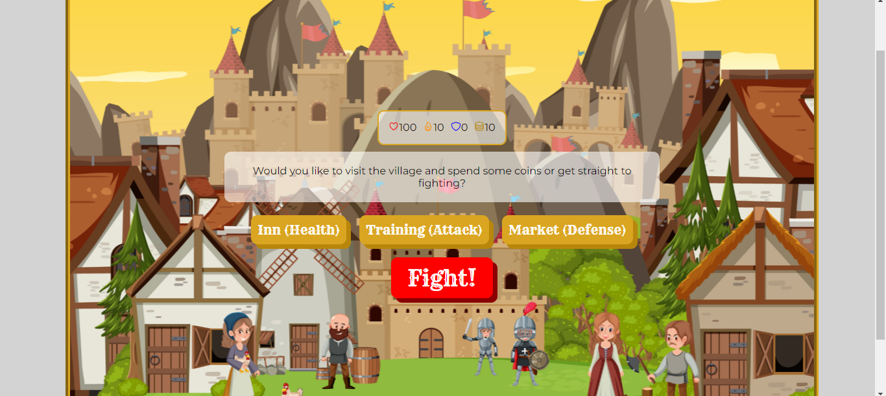

# Knight Battle 🛡️

## Description

Knight Battle is a text battle game created with vanilla Javascript and CSS using DOM manipulation. Created to practice the basics.

## Table of Contents

- [Usage](#usage)
- [Credits](#credits)
- [License](#license)

## Usage

Click through the various screens to play the game. Spend your money at the various locations before battle to level up your skills. You will be awarded 20 coins for each battle won. There are currently 3 battles in the game. Each opponents stats are randomly generated with higher percentages as you go on. Enter in a high score that will save in your localstorage if you win.

### Screenshot

### Links

- [DeployedLink](https://haileythomas.github.io/knight-battle/) - link to deployed website
- [GitHub](https://github.com/HaileyThomas/knight-battle) - link to GitHub project

## Credits

Images were created using Canva Pro. Music is from Freesound.org

## License

[License](https://opensource.org/licenses/MIT) - link to license

MIT License

Copyright (c) [2022] [Hailey Thomas]

Permission is hereby granted, free of charge, to any person obtaining a copy
of this software and associated documentation files (the "Software"), to deal
in the Software without restriction, including without limitation the rights
to use, copy, modify, merge, publish, distribute, sublicense, and/or sell
copies of the Software, and to permit persons to whom the Software is
furnished to do so, subject to the following conditions:

The above copyright notice and this permission notice shall be included in all
copies or substantial portions of the Software.

THE SOFTWARE IS PROVIDED "AS IS", WITHOUT WARRANTY OF ANY KIND, EXPRESS OR
IMPLIED, INCLUDING BUT NOT LIMITED TO THE WARRANTIES OF MERCHANTABILITY,
FITNESS FOR A PARTICULAR PURPOSE AND NONINFRINGEMENT. IN NO EVENT SHALL THE
AUTHORS OR COPYRIGHT HOLDERS BE LIABLE FOR ANY CLAIM, DAMAGES OR OTHER
LIABILITY, WHETHER IN AN ACTION OF CONTRACT, TORT OR OTHERWISE, ARISING FROM,
OUT OF OR IN CONNECTION WITH THE SOFTWARE OR THE USE OR OTHER DEALINGS IN THE
SOFTWARE.

## Questions

For any questions please feel free to contact me below

### Contact

- [Email](mailto:haileyraethomas@gmail.com) - Email Hailey Thomas : haileyraethomas@gmail.com
- [GitHub](https://github.com/HaileyThomas) - GitHub username : HaileyThomas
